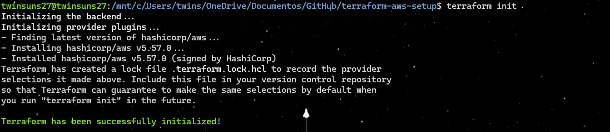
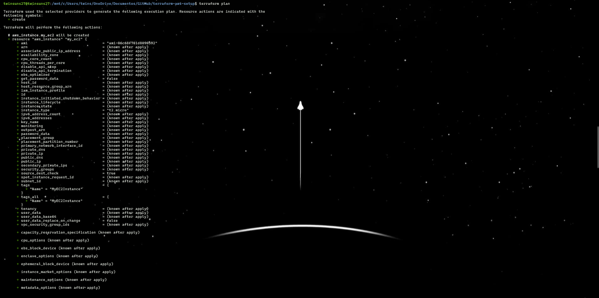
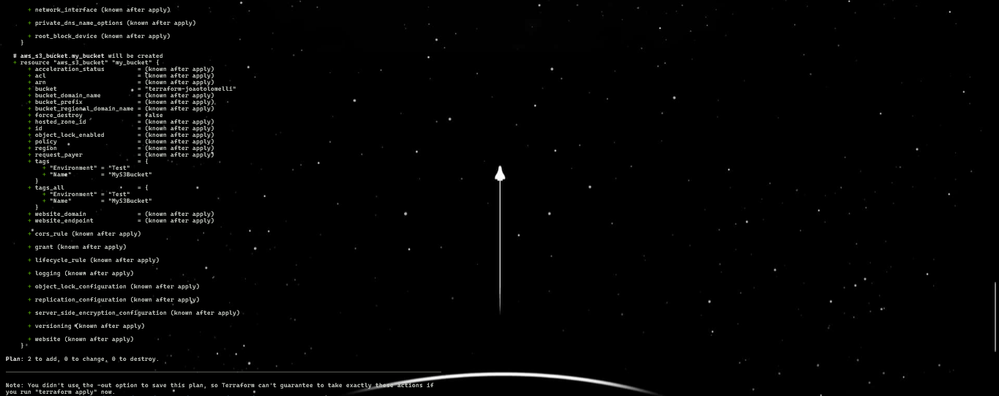
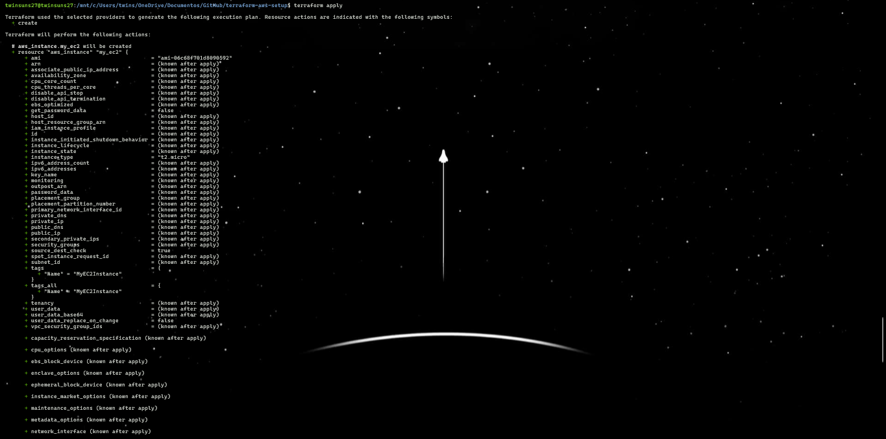
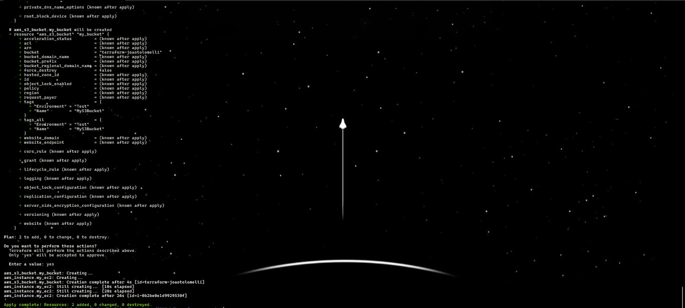
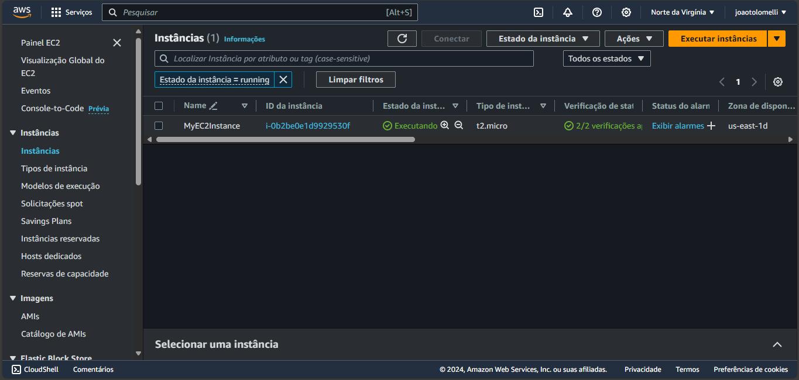
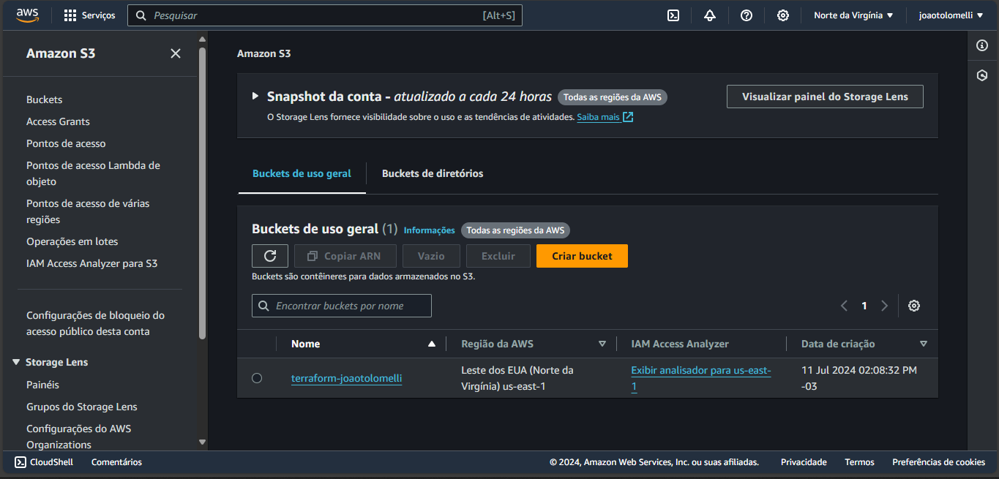
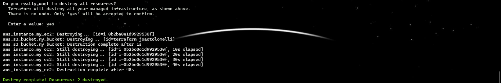
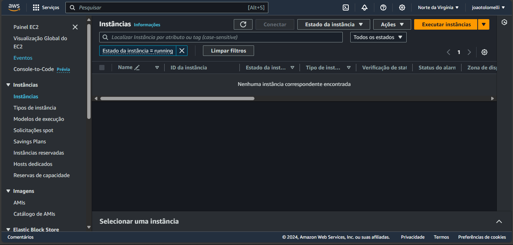
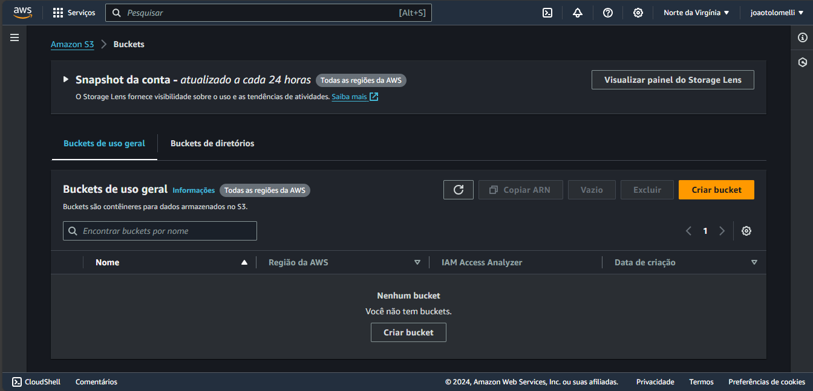

# Criação de .tf para subir um EC2 e um S3

## Inicializar o Terraform
Executando o comando `terraform init`

## Vizualizar o plano de Execução
Executando o comando `teraform plan`

## Aplicar plano 
Executando o comando `teraform apply`

## Verificação da criação dos recursos no console da AWS

## Limpeza dos recursos
Execução do comando `terraform destroy`

## Verificação final dos recursos no console da AWS

